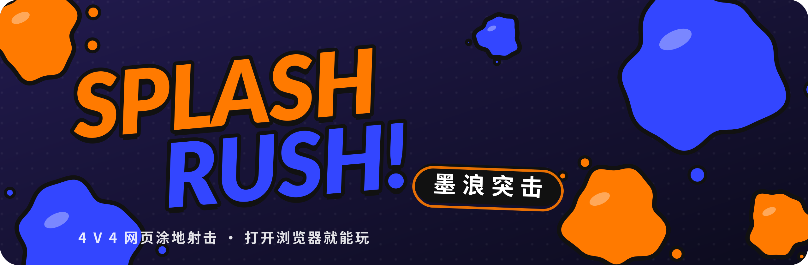
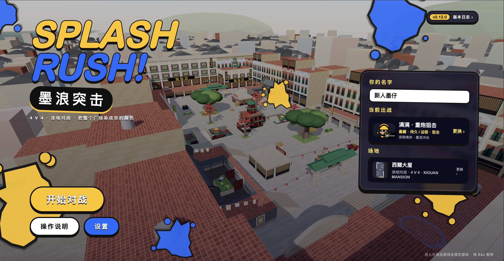
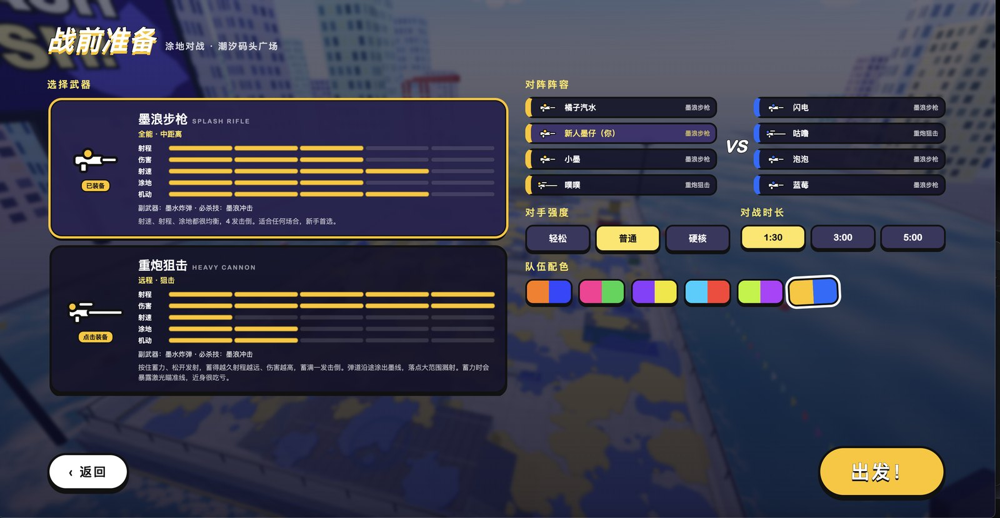

<p align="center">
  
</p>

<p align="center">
  <a href="https://isaachang.github.io/splash-rush/"></a>
  
  
</p>

<p align="center"><b>一个打开浏览器就能玩的 4 V 4 涂地射击游戏。</b><br>
把广场涂成你的颜色，比赛结束时地面覆盖率更高的队伍获胜。</p>

---

## 🎮 快速开始

| 方式 | 步骤 |
|---|---|
| **在线玩** | 打开 **https://isaachang.github.io/splash-rush/**，点「开始对战」 |
| **本地玩** | 下载 [`index.html`](index.html)，双击用 Chrome / Edge / Safari 打开，不需要安装，也不需要联网 |

> 进入对局后游戏会锁定鼠标，按 <kbd>Esc</kbd> 暂停并释放鼠标。

## ⌨️ 操作

| 按键 | 动作 |
|---|---|
| <kbd>W</kbd> <kbd>A</kbd> <kbd>S</kbd> <kbd>D</kbd> | 移动 |
| 鼠标 | 瞄准 |
| <kbd>左键</kbd> | 射击（狙击：按住蓄力，松开发射） |
| <kbd>Shift</kbd> | 潜入墨水：在自己的颜色里高速移动、回墨、回血、隐身，还能爬上涂过的墙 |
| <kbd>空格</kbd> | 跳跃 |
| <kbd>右键</kbd> / <kbd>E</kbd> | 按住瞄准墨水炸弹（显示抛物线），松开投掷 |
| <kbd>Q</kbd> | 必杀技「墨浪冲击」 |
| <kbd>M</kbd> | 打开大地图，点击队友（或按 1/2/3）超级跳过去；阵亡时也能选 |

## ✨ 特色

- **实时涂地**：每一发墨水都会涂在地面和墙上，墨面有光泽和厚度，飞溅的墨滴落到哪就涂到哪
- **两把手感不同的武器**
  - **墨浪步枪**：全能型，子弹几乎瞬间直飞，末端下坠，3 发击倒
  - **重炮狙击**：蓄力瞬间命中，蓄满一发击倒；沿途涂出墨线，有激光瞄准线
- **潜墨与爬墙**：在自己的墨水里游动、隐身、1 秒回满血，还能沿着涂过的墙往上爬
- **超级跳**：打开地图点队友，从天而降直接跳到他身边
- **7 个 AI 队友与对手**：会涂地、抢地盘、交火、回墨，拿狙击的会占高点；难度分三档
- **完整对局流程**：战前准备（选武器、看阵容）→ 开局飞行镜头 → 对局 → 裁判判定 → 结算
- **单文件、零依赖**：整个游戏就是一个 HTML 文件，音乐和音效也是程序实时合成的

## 📸 截图

<p align="center">
   
</p>
<p align="center"><sub>主页（背景是实时涂地的竞技场） · 战前准备（选武器、看阵容）</sub></p>

## 🛠 开发

```bash
./tools/build.sh             # 把 src/ 打包成 index.html
node tools/smoke-test.js     # 无浏览器自动跑完整对局，检查有没有报错
node tools/feature-test.js   # 逐项验证核心机制（蓄力、准星、炸弹、防护罩……）
```

```
src/
  style.css  body.html       界面样式与结构
  js/01_core.js              工具函数、音效与音乐、渲染器、程序纹理
  js/02_world.js             地图、涂地系统、墨水着色器、竞技场建模
  js/03_env.js               天空、海面、城市等环境
  js/04_data.js              武器 / 副武器 / 必杀技数据、玩家存档
  js/05_character.js         角色模型、移动、潜墨、武器逻辑
  js/06_fx.js                粒子、子弹、炸弹、飞溅
  js/07_ai_input.js          寻路、AI、输入、镜头
  js/08_game.js              界面、对局流程、启动
vendor/three.min.js          Three.js r158（MIT）
tools/                       构建与测试脚本
```

开发流程和分支规范见 [docs/DEVELOPMENT.md](docs/DEVELOPMENT.md)，版本记录见 [CHANGELOG.md](CHANGELOG.md)。

---

<sub>个人学习项目，玩法受墨水涂地类射击游戏启发，角色、美术、代码均为原创。非官方作品，与任天堂无任何关联。</sub>
